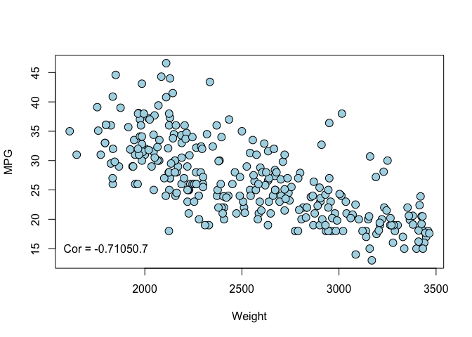
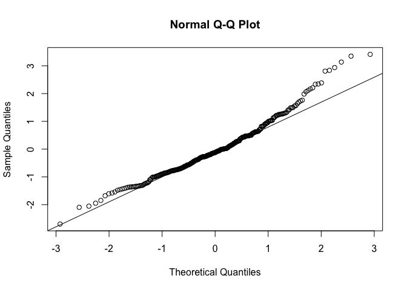
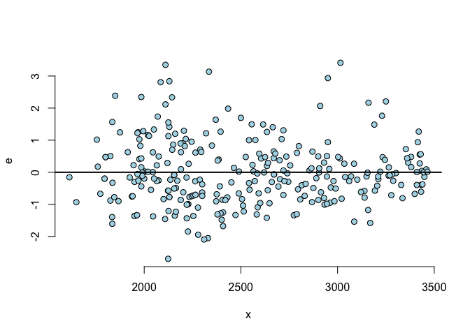
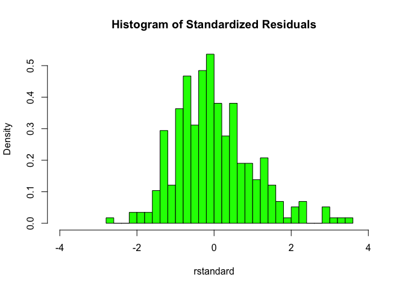

# Car MPG
ccf  
January 17, 2016  

This is an R markdown file for the car mpg data shown in class.  We will reporduce some of the SAS output using R and Rstudio.

First we need to read the data into R.


```r
carmpg <- read.table("~/Documents/MATH3710/cars/MPGData.txt", header = TRUE)
summary(carmpg)
```

```
##      Weight          MPG       
##  Min.   :1613   Min.   :13.00  
##  1st Qu.:2130   1st Qu.:21.00  
##  Median :2489   Median :26.00  
##  Mean   :2535   Mean   :26.66  
##  3rd Qu.:2930   3rd Qu.:31.50  
##  Max.   :3465   Max.   :46.60
```

```r
cor(carmpg)
```

```
##            Weight        MPG
## Weight  1.0000000 -0.7105168
## MPG    -0.7105168  1.0000000
```


Above are simple summary statistics of the data.

Now let's look at a scatter plot of the data.


```r
plot(MPG ~ Weight, data=carmpg, bg = "lightblue", 
     col = "black", cex = 1.5, pch = 21)
text(x=1800, y=15, paste0("Cor = ",round(cor(carmpg)[2], 4), cex = 0.7))
```

\


Now we fit a linear model in R using the lm function. We will store it in a variable for more use.


```r
fit <- lm(MPG ~ Weight, data = carmpg)
summary(fit) # displays a summary of the model.
```

```
## 
## Call:
## lm(formula = MPG ~ Weight, data = carmpg)
## 
## Residuals:
##      Min       1Q   Median       3Q      Max 
## -12.7011  -3.3404  -0.5987   2.3588  16.0605 
## 
## Coefficients:
##               Estimate Std. Error t value Pr(>|t|)    
## (Intercept) 51.5871689  1.4835394   34.77   <2e-16 ***
## Weight      -0.0098334  0.0005749  -17.11   <2e-16 ***
## ---
## Signif. codes:  0 '***' 0.001 '**' 0.01 '*' 0.05 '.' 0.1 ' ' 1
## 
## Residual standard error: 4.723 on 287 degrees of freedom
## Multiple R-squared:  0.5048,	Adjusted R-squared:  0.5031 
## F-statistic: 292.6 on 1 and 287 DF,  p-value: < 2.2e-16
```


Now we will use R to check the assumptions of the model. First we will store the standardized residuals from "fit" and store them in a variable.


```r
e <- rstandard(fit)
summary(e)
```

```
##    Min. 1st Qu.  Median    Mean 3rd Qu.    Max. 
## -2.6970 -0.7087 -0.1273  0.0001  0.5022  3.4120
```

More diagnostic plots of our model:

```r
qqnorm(e)
qqline(e)
```

\

```r
# Residuals vs. x
x <- carmpg$Weight
plot(x, e, bg = "lightblue", 
     col = "black", cex = 1.1, pch = 21,frame = FALSE)
abline(h = 0, lwd = 2)
```

\

One more plot.  Here we will look at a histogram of the residuals.


```r
hist(e, breaks = 25, col = "green", freq = FALSE, xlim = c(-4,4), 
     main = "Histogram of Standardized Residuals", xlab = "rstandard")
```

\
