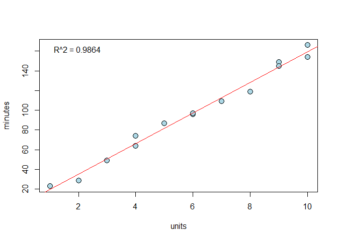
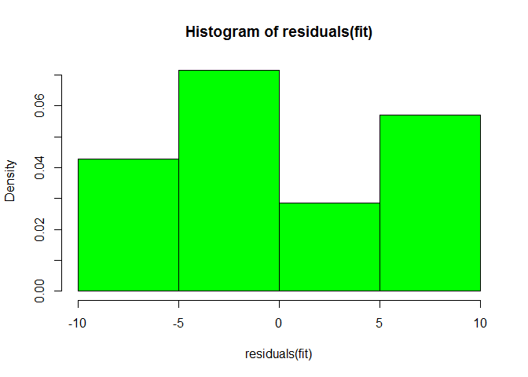
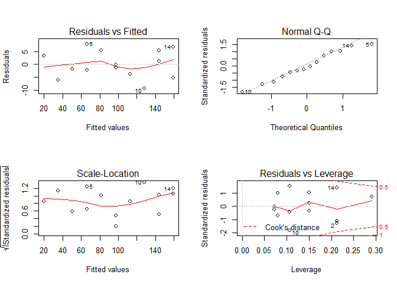

# CARS_MATH3710
Cody Frisby  
December 15, 2015  

Let's get started with R.  This first data set is small so we have the data loaded into two variable: minutes and units.  We then put them together witht the cbind function and store the result in a new variable called repair. 


```r
minutes <- c(23,29,49,64,74,87,96,97,109,119,149,145,154,166, NA)
units <- c(1,2,3,4,4,5,6,6,7,8,9,9,10,10,3)
repair <- as.data.frame(cbind(minutes, units))
head(repair)
```

```
##   minutes units
## 1      23     1
## 2      29     2
## 3      49     3
## 4      64     4
## 5      74     4
## 6      87     5
```

```r
summary(repair)
```

```
##     minutes           units     
##  Min.   : 23.00   Min.   : 1.0  
##  1st Qu.: 66.50   1st Qu.: 3.5  
##  Median : 96.50   Median : 6.0  
##  Mean   : 97.21   Mean   : 5.8  
##  3rd Qu.:138.50   3rd Qu.: 8.5  
##  Max.   :166.00   Max.   :10.0  
##  NA's   :1
```

Above is a summary of the data table "repair".
Now let's plot the data look at the variable minutes being modeled as a function of units.


```r
attach(repair) #attaching the data makes our code below simpler.
```

```
## The following objects are masked _by_ .GlobalEnv:
## 
##     minutes, units
```

```r
plot(units, minutes, pch = 16)
```

 

```r
cor(repair, use = "complete.obs")[2] #correllation coefficient
```

```
## [1] 0.9936987
```

```r
fit <- lm(minutes ~ units, data = repair)
summary(fit)
```

```
## 
## Call:
## lm(formula = minutes ~ units, data = repair)
## 
## Residuals:
##     Min      1Q  Median      3Q     Max 
## -9.2318 -3.3415 -0.7143  4.7769  7.8033 
## 
## Coefficients:
##             Estimate Std. Error t value Pr(>|t|)    
## (Intercept)    4.162      3.355    1.24    0.239    
## units         15.509      0.505   30.71 8.92e-13 ***
## ---
## Signif. codes:  0 '***' 0.001 '**' 0.01 '*' 0.05 '.' 0.1 ' ' 1
## 
## Residual standard error: 5.392 on 12 degrees of freedom
##   (1 observation deleted due to missingness)
## Multiple R-squared:  0.9874,	Adjusted R-squared:  0.9864 
## F-statistic: 943.2 on 1 and 12 DF,  p-value: 8.916e-13
```

```r
hist(residuals(fit), col = "green", freq = FALSE)
```

 


```r
par(mfrow=c(2,2)) #setup your window to fit the next plots
plot(fit)
```

 
