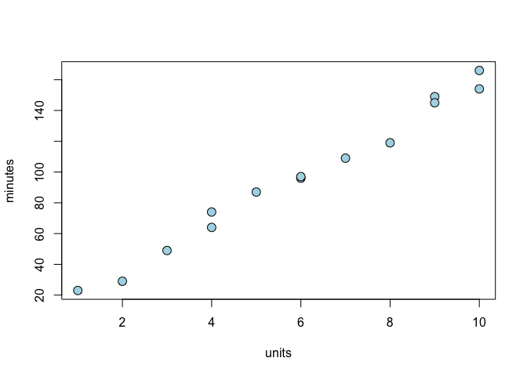
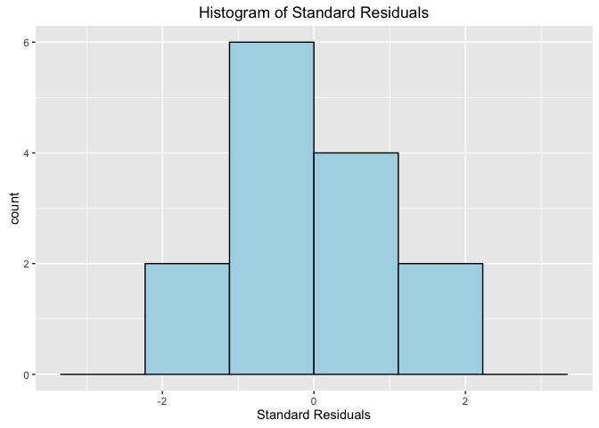

# Computer Repairs
ccfrisby  
January 4, 2016  


Let's get started with simple linear regression using R.  This first data set is small so we have the data loaded into two variables: minutes and units.  We then put them together with the cbind function and store the result in a new variable called repair.


```r
units <- c(1,2,3,4,4,5,6,6,7,8,9,9,10,10,3)
minutes <- c(23,29,49,64,74,87,96,97,109,119,149,145,154,166, NA)
repair <- as.data.frame(cbind(units, minutes))
repair <- repair[complete.cases(repair), ] 
# note, the above line removes missing values.
describe(repair)
```

```
##         vars  n  mean    sd median trimmed   mad min max range  skew
## units      1 14  6.00  2.96    6.0    6.08  3.71   1  10     9 -0.12
## minutes    2 14 97.21 46.22   96.5   97.67 59.30  23 166   143 -0.09
##         kurtosis    se
## units      -1.43  0.79
## minutes    -1.37 12.35
```

Above is a summary of the data table "repair".  Below is a table of the correlation coefficients.  


```r
cor(repair, method = "pearson", use = "complete.obs")
```

```
##             units   minutes
## units   1.0000000 0.9936987
## minutes 0.9936987 1.0000000
```

Here's a scatter plot of the data.

 


Now to display a summary of the model.  Above we fit a model with minutes being function of units.  We stored this model in a variable called m.


```r
m <- lm(minutes ~ units, data = repair)
anova(m) #ANOVA table
```

```
## Analysis of Variance Table
## 
## Response: minutes
##           Df  Sum Sq Mean Sq F value    Pr(>F)    
## units      1 27419.5 27419.5   943.2 8.916e-13 ***
## Residuals 12   348.8    29.1                      
## ---
## Signif. codes:  0 '***' 0.001 '**' 0.01 '*' 0.05 '.' 0.1 ' ' 1
```

```r
summary(m) #summary of linear model
```

```
## 
## Call:
## lm(formula = minutes ~ units, data = repair)
## 
## Residuals:
##     Min      1Q  Median      3Q     Max 
## -9.2318 -3.3415 -0.7143  4.7769  7.8033 
## 
## Coefficients:
##             Estimate Std. Error t value Pr(>|t|)    
## (Intercept)    4.162      3.355    1.24    0.239    
## units         15.509      0.505   30.71 8.92e-13 ***
## ---
## Signif. codes:  0 '***' 0.001 '**' 0.01 '*' 0.05 '.' 0.1 ' ' 1
## 
## Residual standard error: 5.392 on 12 degrees of freedom
## Multiple R-squared:  0.9874,	Adjusted R-squared:  0.9864 
## F-statistic: 943.2 on 1 and 12 DF,  p-value: 8.916e-13
```

Here we attempt to reproduce some of the output from the Proc Reg command in SAS.

```r
# add confidnece intervals
p <- predict.lm(m, se.fit = T, interval = "confidence")
psub <- p$fit[,2:3]
colnames(psub) <- c("95% Conf Lower", "95% Conf Upper")
s <- cbind(psub, stderror = p$se.fit)
# still need to add prediction intervals
# cbind is the commmand that binds columns together in either a 
# data frame or matrix.
t <- cbind(repair$minutes, fitted.values(m), residuals(m))
colnames(t) <- c("observed", "predicted", "residuals")
cbind(t, s)
```

```
##    observed predicted  residuals 95% Conf Lower 95% Conf Upper stderror
## 1        23  19.67043  3.3295739       13.33625       26.00460 2.907169
## 2        29  35.17920 -6.1791980       29.77303       40.58537 2.481245
## 3        49  50.68797 -1.6879699       46.13246       55.24348 2.090821
## 4        64  66.19674 -2.1967419       62.36271       70.03077 1.759688
## 5        74  66.19674  7.8032581       62.36271       70.03077 1.759688
## 6        87  81.70551  5.2944862       78.37864       85.03239 1.526920
## 7        96  97.21429 -1.2142857       94.07462      100.35395 1.440999
## 8        97  97.21429 -0.2142857       94.07462      100.35395 1.440999
## 9       109 112.72306 -3.7230576      109.39618      116.04993 1.526920
## 10      119 128.23183 -9.2318296      124.39780      132.06586 1.759688
## 11      149 143.74060  5.2593985      139.18509      148.29611 2.090821
## 12      145 143.74060  1.2593985      139.18509      148.29611 2.090821
## 13      154 159.24937 -5.2493734      153.84321      164.65554 2.481245
## 14      166 159.24937  6.7506266      153.84321      164.65554 2.481245
```


Below is a plot of the residuals vs fitted and the Normal Quantile plot.  

  


Now to plot a histogram of the residuals from our model.


 


Or we can plot the residuals this way, using ggplot.

 

Here we attempt to reproduce the same output as the Proc Univariate command in SAS.  Here the variable of interest is from our model m, rstandard.  

```r
describe(rstandard(m)) #this is using the library psych
```

```
##   vars  n mean   sd median trimmed  mad   min  max range  skew kurtosis
## 1    1 14    0 1.04  -0.14    0.03 1.36 -1.81 1.53  3.34 -0.06    -1.34
##     se
## 1 0.28
```

```r
t.test(rstandard(m))
```

```
## 
## 	One Sample t-test
## 
## data:  rstandard(m)
## t = 0.0117, df = 13, p-value = 0.9908
## alternative hypothesis: true mean is not equal to 0
## 95 percent confidence interval:
##  -0.5986728  0.6051926
## sample estimates:
##   mean of x 
## 0.003259935
```

```r
#or, using base R
x <- rstandard(m)
mean(x)
```

```
## [1] 0.003259935
```

```r
sd(x) 
```

```
## [1] 1.042519
```

```r
summary(x) 
```

```
##     Min.  1st Qu.   Median     Mean  3rd Qu.     Max. 
## -1.81100 -0.64770 -0.13750  0.00326  0.95120  1.53100
```

```r
var(x)
```

```
## [1] 1.086846
```

The below code reproduces the SAS output:
_(/* Computing normal scores for QQ plot or Gauss-Rankit Plot */
proc rank normal=blom data=diagnostic out=newdata;
	var stdresid;
	ranks nscores;
proc print data = newdata;)
	title 'normal scores'; run;_
Except for nscores. 


```r
u <- cbind(t, rstandard(m), hatvalues(m))
colnames(u) <- c("observed", "predicted", "residuals", "stdresid", "hatvals")
print(u)
```

```
##    observed predicted  residuals    stdresid    hatvals
## 1        23  19.67043  3.3295739  0.73325354 0.29072682
## 2        29  35.17920 -6.1791980 -1.29086405 0.21177945
## 3        49  50.68797 -1.6879699 -0.33964371 0.15037594
## 4        64  66.19674 -2.1967419 -0.43103048 0.10651629
## 5        74  66.19674  7.8032581  1.53110484 0.10651629
## 6        87  81.70551  5.2944862  1.02388106 0.08020050
## 7        96  97.21429 -1.2142857 -0.23371442 0.07142857
## 8        97  97.21429 -0.2142857 -0.04124372 0.07142857
## 9       109 112.72306 -3.7230576 -0.71998832 0.08020050
## 10      119 128.23183 -9.2318296 -1.81140988 0.10651629
## 11      149 143.74060  5.2593985  1.05826626 0.15037594
## 12      145 143.74060  1.2593985  0.25340900 0.15037594
## 13      154 159.24937 -5.2493734 -1.09661925 0.21177945
## 14      166 159.24937  6.7506266  1.41023822 0.21177945
```

```r
# confidence intervals and se values can be obtained in R by using
# predict.lm(m, se.fit = T, interval = "confidence")
# 
```


